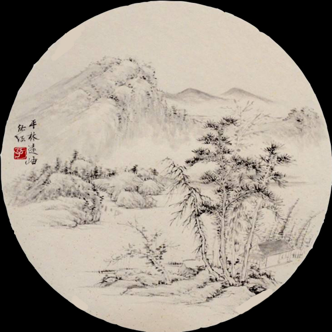

# DAT505-Code
This is a describtion about final project for DAT505 module

Name：Yunqing Shao

Registration  Number:B161006078

----------
## About this project

This project is aim to describe the relationship between universe and city.A city was put in solar system while earth,moon,mercury,jupiter,saturnus and other stars rotate in it.I want to express that with the rapid growth of population the earth can not afford more.The spaces are becoming more and more crowed.At the same time I want to combine ancient culture with modern technology.I put small planet with huge and crowned buildings to creates a sharp contrast.

We can see this sceen from different angles by moving mouse and we can find that many planets rotate in various angles and all of them will pass by cities.There is a universe background and background music in this scene and I also put fog in this place to make cities look more beautiful.The moon will has a bright halo around it because I want to show that it is the central point and everything rotate around it.When we click earth there will be a halo appear around the earth because earth play an important role in solar system and it is home for us.

On the other hand when we click other planet there will appear a picture on the screen.Choosing different planets
will show different pictures and they are all chinese paintings by ancient artist Tao Shi in Xieyi style.Tao Shi is one of the most outstanding painters in chinese history and his works are regarded as a symbol of traditional chinese paintings.When we click the button the picture will disappear.There are also many meteorolites around planets so that it can make the scene look like a real universe.

The control page on the screen can change position,rotation of earth.From my perspective that planetary motion is interesting and I want to know what will it look like after putting them with people's surroundings.

When I make this project I met some problems.For example,I plan to make different objects rotate around the central point so that I search for references on the Internet and try a lot of times but there always be many mistakes.Finally I find a simple solution that put one mesh in the  mesh2 and define rotation of mesh2 so that mesh and mesh2 are in one group and when mesh2 rotate mesh can rotate with it.On the screen it looks like mesh rotate around mesh2.

At the beginning I want to put background in this screen and I find that there are many ways to load background such as loade panoramic picture and create skybox.From my point of view that creating skybox is easier for my laptop to run so that I choose this.

Another challenge for me is to create a function that click the object there will be a picture appear on the screen.I put a intersect on object and load a corresponding picture to UI.I find some related references about how to make UI page on the Internet and create two kinds of UI.One is created by codes which are in HTMl and the other one is created by css.Both of them need reflect in js and I design size of UI in css while load pictures in js.To be more specific,UI page also has a button which can make it disappear and I ask teacher for help about how to create a button.

During the process of making project I find that there are many ways to make a same function and we can choose the most valuable one.Many functions seem to be very difficult but actually they just need simple codes.In conclusion,this project is a very interesting experience for me to learn about three.js.

-------
### Structure

1.Pictures are from images and textures(images for UI and textures for geometry)

2.codes from css and js

*Picture*


This is one of the pictures for UI page and they are all 567*567px.

------

*Screen Preview*


When we click the planet there will be a picture which shows chinese traditional painting.After clicking the button "Continue" the picture will disappear.


When we click earth there will appear a bright halo around earth and when we click earth again the halo will disappear.


Clicking different planets will show corresponding paintings.

------

*Codes*
```
scene = new THREE.Scene();
scene.add(clickGroup);
scene.background = new THREE.CubeTextureLoader()//add skybox and put pictures on it
  .setPath('textures//')
  .load(['star.jpg', 'star1.jpg', 'star2.jpg', 'star3.jpg', 'star4.jpg', 'star5.jpg']);//load pictures

```
These codes are to create new scene and sky box which consist of the background.

```
<div id="UI">universe</div>
<div class="ui-dialog ui-dialog-operate">
  <div class="ui-dialog-cnt" style="border: 1px solid #ffffff;">
    
    <div class="ui-dialog-ft">
      <button type="button" data-role="button" class="ui-btn">Continue</button>
```
These codes from index.html are to create UI page and decide details like contents on button.

```
.ui-img {
  width: 567px;
  padding-top: 100%
}

.ui-img {
  position: relative;
  height: 100%;
  overflow: hidden;
}
```
These codes from css.style are to decide size of UI and range of picture which will be showed on the screen.

-----

*GitHub Link*

https://github.com/balawahu/DAT505-Code/tree/master/Final%20Project1

----------

20/04/2019
