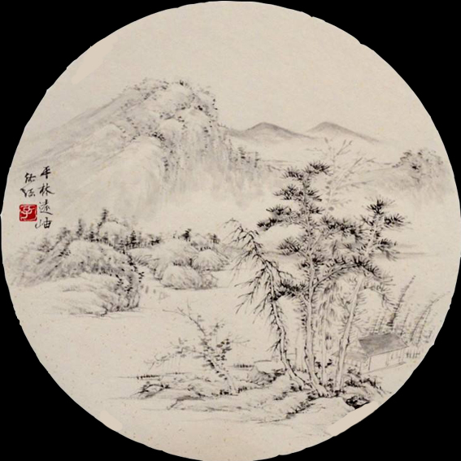

# DAT505-Code
This is a describtion about final project for DAT505 module

Name：Yunqing Shao

----------
*About this project*

This project is aim to describe the relationship between universe and city.A city was put in solar system while earth,moon,mercury,jupiter,saturnus and other stars rotate in it.I want to express that with the rapid growth of population the earth can not afford more.At the same time I want to combine ancient culture with modern technology.I put small planet with huge and crowned buildings to creates a sharp contrast.

We can see this sceen from different angles by moving mouse and we can find that many planets rotate in various angles and all of them will pass by cities.There is a universe background in this scene and I also put fog in this place to make cities look more beautiful.The moon will has a bright halo around it because I want to show that it is the central point and everything rotate around it.When we click earth there will be a halo appear around the earth because earth play an important role in solar system and it is home for us.

On the other hand when we click other planet there will appear a picture on the screen.Choosing different planets
will show different pictures and they are all chinese paintings by ancient artist Tao Shi in Xieyi style.Tao Shi is one of the most outstanding painters in chinese history and his works are regarded as a symbol of traditional chinese paintings.When we click the button the picture will disappear.There are also many meteorolites around planets so that it can make the scene look like a real universe.

The control page on the screen can change position,rotation of earth.From my perspective that planetary motion is interesting and I want to know what will it look like after putting them with people's surroundings.


When we click the planet there will be a picture which shows chinese traditional painting.After clicking the button "Continue" the picture will disappear.


When we click earth there will appear a bright halo around earth and when we click earth again the halo will disappear.


Clicking different planets will show corresponding paintings.

```
scene = new THREE.Scene();
scene.add(clickGroup);
scene.background = new THREE.CubeTextureLoader()//add skybox and put pictures on it
  .setPath('textures//')
  .load(['star.jpg', 'star1.jpg', 'star2.jpg', 'star3.jpg', 'star4.jpg', 'star5.jpg']);//load pictures

```
These codes are to create new scene and sky box which consist of the background.

```
<div id="UI">universe</div>
<div class="ui-dialog ui-dialog-operate">
  <div class="ui-dialog-cnt" style="border: 1px solid #ffffff;">
    
    <div class="ui-dialog-ft">
      <button type="button" data-role="button" class="ui-btn">Continue</button>
```
These codes from index.html are to create UI page and decide details like contents on button.

```
.ui-img {
  width: 567px;
  padding-top: 100%
}

.ui-img {
  position: relative;
  height: 100%;
  overflow: hidden;
}
```
These codes from css.style are to decide size of UI and range of picture which will be showed on the screen.

*GitHub Link*
https://github.com/balawahu/DAT505-Code

----------

20/04/2019
